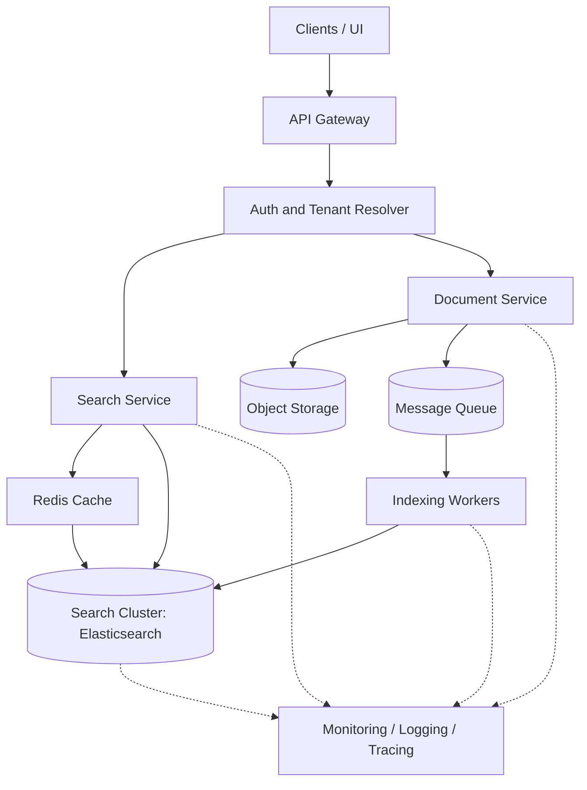
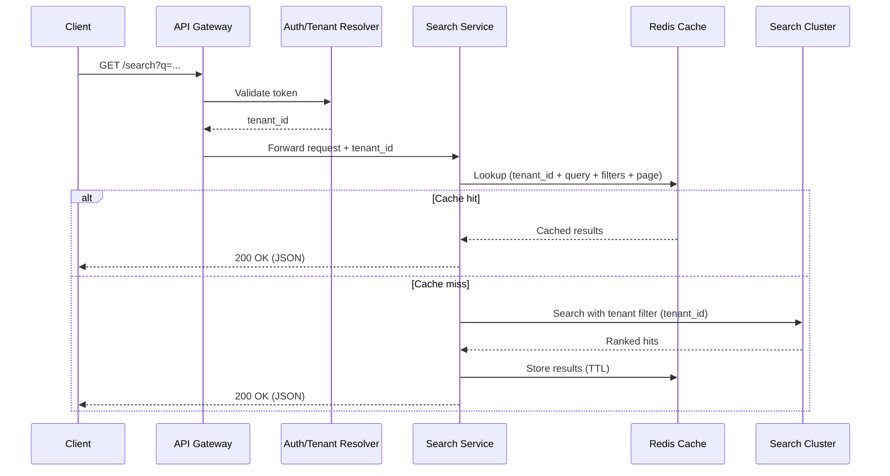
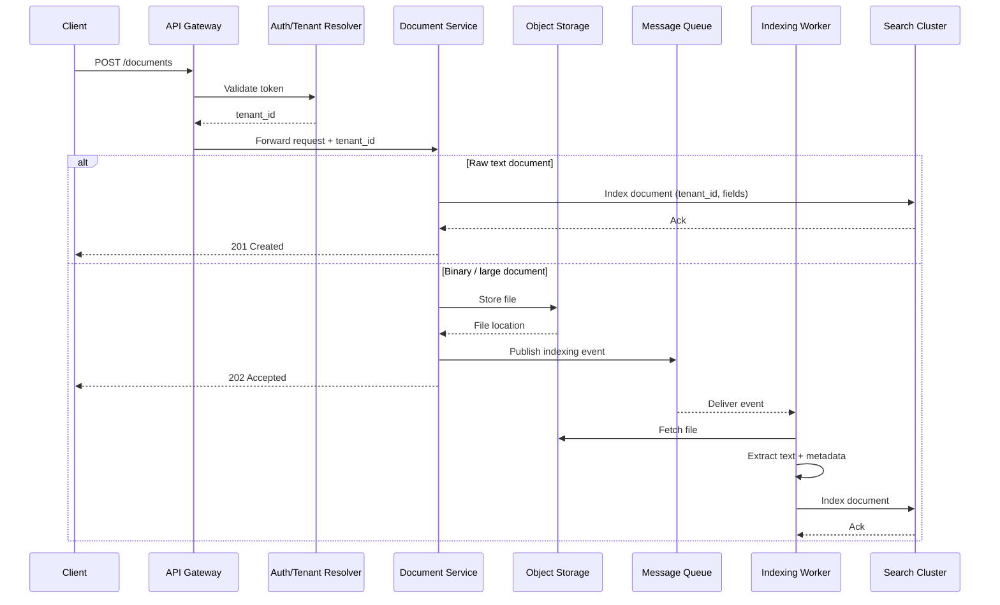

# Architecture Design Document

## Overview

This document describes the architecture of the Distributed Document Search Service, a multi-tenant system capable of searching through millions of documents with sub-second response times.

## System Requirements

- Handle 10+ million documents across multiple tenants
- Support full-text search with relevance ranking (BM25)
- Return results in under 500ms for 95th percentile queries
- Handle 1000+ concurrent searches per second
- Provide tenant isolation and security
- Scale horizontally as document volume grows

## High-Level Architecture

## Component Overview

### 1. API Gateway / Load Balancer
- Routes requests to appropriate services
- Handles TLS termination
- Enforces global rate limiting
- Provides request/response logging

### 2. Auth & Tenant Resolver
- Validates authentication tokens (JWT in production)
- Extracts tenant ID from token claims or headers
- Attaches tenant context to requests
- Ensures no request proceeds without valid tenant identification

### 3. Search Service (Stateless)
- Implements `GET /search` and `GET /documents/{id}` endpoints
- Enforces tenant scoping on all queries
- Builds optimized search queries with BM25 ranking
- Manages Redis cache for hot queries
- Communicates with OpenSearch cluster

### 4. Document Service (Stateless)
- Implements `POST /documents` and `DELETE /documents/{id}` endpoints
- Handles document ingestion
- For raw text: indexes synchronously
- For large/binary files: stores in object storage and publishes indexing events

### 5. Redis Cache
- Caches search results per tenant (120s TTL)
- Caches document details per tenant (60s TTL)
- Used for rate limiting counters
- Tenant-scoped cache keys prevent cross-tenant leakage

### 6. OpenSearch Cluster
- Primary data store for indexed documents
- Sharded and replicated for horizontal scale
- Uses inverted index for full-text search
- BM25 ranking algorithm for relevance

### 7. Message Queue (Future Enhancement)
- Decouples ingestion from indexing
- Handles retries and backpressure
- Enables async processing of large documents

### 8. Indexing Workers (Future Enhancement)
- Consume events from message queue
- Extract text from binary files (PDF, DOCX)
- Index documents into OpenSearch

## Data Flow Diagrams

### Search Flow

### Indexing Flow

## Storage Strategy

### Primary Search Engine: OpenSearch

**Why OpenSearch?**
- Open-source, Elasticsearch-compatible
- Built-in full-text search with BM25 ranking
- Horizontal scalability via sharding
- High availability via replication
- Rich query DSL for complex searches

**Index Structure:**
- Single index: `documents` (prototype)
- Fields: `tenant_id`, `doc_id`, `title`, `content`, `tags`, `metadata`, `created_at`, `updated_at`
- Sharding: 5 primary shards (production), 1 replica per shard

**Document ID Strategy:**
- Composite ID: `${tenant_id}_${doc_id}`
- Ensures uniqueness across tenants
- Enables efficient tenant filtering

### Cache Layer: Redis

**Purpose:**
- Reduce load on OpenSearch cluster
- Improve response times for hot queries
- Store rate limiting counters

**Cache Keys:**
- Search: `search:{tenant_id}:{query_hash}`
- Document: `doc:{tenant_id}:{doc_id}`
- Rate limit: `ratelimit:{tenant_id}:{window}`

**TTL Strategy:**
- Search results: 120 seconds
- Document details: 60 seconds
- Rate limit counters: Window duration

### Object Storage (Future)

For large binary files (PDF, DOCX):
- Store raw files in S3/GCS/Azure Blob
- Only extracted text + metadata in OpenSearch
- Reduces index size and improves search performance

## Multi-Tenancy Strategy

### Chosen Approach: Shared Index + Tenant Filter

**Implementation:**
- Single OpenSearch index: `documents`
- Each document includes `tenant_id` field (keyword type)
- All queries include mandatory tenant filter: `{ term: { tenant_id: "tenant-123" } }`
- Tenant ID never comes from user input; only from authenticated context

**Pros:**
- Efficient for many small/medium tenants
- Easier operational management (fewer indices)
- Shared infrastructure costs
- Simpler query logic

**Cons:**
- Logical isolation only (noisy neighbors possible)
- Harder to move large tenants to dedicated infrastructure

### Alternative: Index-Per-Tenant

**When to Use:**
- Very large tenants (>10M documents)
- Need strict performance isolation
- Regulatory requirements for physical separation

**Implementation:**
- Each tenant gets own index: `documents_tenant_123`
- Stronger isolation and independent scaling
- More operational complexity

**Current Prototype:**
- Uses shared index approach
- Architecture supports both strategies
- Can migrate large tenants to dedicated indices as needed

## Consistency Model

### OpenSearch Consistency

**Write Consistency:**
- Writes are durable after acknowledgment
- Documents become searchable after refresh (default: 1 second)
- Near-real-time (NRT) consistency model

**Read Consistency:**
- Searches may see slightly stale data (up to 1 second)
- Acceptable for search use case
- Can force refresh for critical writes (at performance cost)

### System-Wide Consistency

**Document Creation:**
- `POST /documents` → Document searchable within ~1 second
- Cache invalidated to prevent stale reads

**Document Updates:**
- Currently not implemented (would require versioning)
- Future: Use OpenSearch document versioning

**Document Deletion:**
- Immediate deletion from index
- Cache invalidated immediately

**Trade-offs:**
- Chose eventual consistency for performance
- Acceptable for search workloads
- Can add synchronous refresh for critical operations if needed

## Caching Strategy

### Cache Layers

**1. Application Cache (Redis)**
- Search results: `search:{tenant_id}:{query_hash}`
- Document details: `doc:{tenant_id}:{doc_id}`
- TTL-based expiration
- LRU eviction for memory management

**2. OpenSearch Internal Caches**
- Query cache: Caches query results
- Filter cache: Caches filter results (benefits from frequent tenant_id filters)
- Field data cache: Caches field values

### Cache Invalidation

**On Document Create/Update:**
- Invalidate all search caches for tenant (pattern: `search:{tenant_id}:*`)
- Invalidate specific document cache

**On Document Delete:**
- Invalidate document cache
- Invalidate tenant search caches

**TTL-Based Expiration:**
- Soft invalidation via TTL
- Acceptable for prototype
- Production: Could maintain cache key registry per tenant for precise invalidation

## Rate Limiting Strategy

### Per-Tenant Rate Limiting

**Algorithm:** Sliding Window (Redis-based)

**Implementation:**
- Key: `ratelimit:{tenant_id}:{window_start}`
- Counter incremented on each request
- Window: 60 seconds (configurable)
- Max requests: 100 per window (configurable)

**Response Headers:**
- `X-RateLimit-Limit`: Maximum requests allowed
- `X-RateLimit-Remaining`: Remaining requests in window
- `X-RateLimit-Reset`: Window reset time
- `Retry-After`: Seconds until retry allowed

**Fail-Open Strategy:**
- If Redis unavailable, allow request (log error)
- Prevents Redis failure from blocking all requests
- Production: Could use circuit breaker pattern

## Security Considerations

### Authentication & Authorization

**Prototype:**
- Header-based: `X-Tenant-Id`
- Simple validation (format check)

**Production:**
- JWT tokens with tenant_id claim
- Token validation via API Gateway or auth service
- Never trust tenant_id from query parameters

### Tenant Isolation

**Enforcement Points:**
1. **API Layer:** Tenant ID extracted from trusted source (JWT/header)
2. **Service Layer:** All queries include tenant filter
3. **Cache Layer:** Tenant-scoped cache keys
4. **OpenSearch:** Mandatory tenant_id filter in all queries

**Security Measures:**
- No tenant_id in user-controlled input
- Validate tenant_id format
- Log all tenant access attempts
- Monitor for cross-tenant access patterns

### Network Security

**Production Requirements:**
- OpenSearch cluster in private subnet (not publicly accessible)
- Redis in private subnet
- TLS for all inter-service communication
- VPC security groups restrict access

## Scalability Considerations

### Horizontal Scaling

**Stateless Services:**
- Search Service and Document Service are stateless
- Can scale horizontally by adding instances
- Load balancer distributes traffic

**OpenSearch Scaling:**
- Add nodes to cluster
- Redistribute shards across nodes
- Increase replicas for read scaling

**Redis Scaling:**
- Redis Cluster mode for horizontal scaling
- Shard data across multiple nodes
- Or use managed service (ElastiCache)

### Performance Optimization

**Query Optimization:**
- Use filters (not queries) for tenant_id (faster, cacheable)
- Limit result size (max 50 per page)
- Use `_source` filtering to return only needed fields
- Avoid deep pagination (use search_after for large offsets)

**Index Optimization:**
- Proper field mappings (keyword vs text)
- Index only searchable fields
- Use ILM (Index Lifecycle Management) for old data

**Caching:**
- Cache hot queries aggressively
- Use CDN for static assets (if any)
- Consider application-level caching for metadata

## Fault Tolerance

### Service Failures

**Stateless Services:**
- Multiple instances behind load balancer
- Health checks remove unhealthy instances
- No data loss on instance failure

**OpenSearch:**
- Replica shards provide redundancy
- Cluster automatically rebalances on node failure
- Data durability via replication

**Redis:**
- Redis Sentinel for high availability
- Or managed service with automatic failover
- Cache miss is acceptable (fallback to OpenSearch)

### Error Handling

**Retry Strategy:**
- Exponential backoff for transient failures
- Circuit breaker pattern for persistent failures
- Dead letter queue for failed indexing jobs

**Graceful Degradation:**
- Cache unavailable → Skip cache, query OpenSearch directly
- OpenSearch unavailable → Return 503, log error
- Rate limiter unavailable → Fail open (allow request)

## Observability

### Logging

**Structured Logging:**
- Winston logger with JSON format
- Log levels: error, warn, info, debug
- Include tenant_id, request_id, timing in logs

**Log Aggregation:**
- Ship logs to centralized system (ELK, CloudWatch)
- Enable log rotation and retention policies

### Metrics

**Key Metrics:**
- Request rate per endpoint
- P95/P99 latency per endpoint
- Error rate per endpoint
- Cache hit ratio
- OpenSearch query latency
- Rate limit violations per tenant

**Monitoring:**
- Prometheus + Grafana (or CloudWatch)
- Alert on high latency, error rates, dependency failures

### Distributed Tracing

**Implementation:**
- Add request ID to all logs
- Trace requests across services
- Use AWS X-Ray or Jaeger for production

## Future Enhancements

1. **Async Ingestion Pipeline:** Message queue + workers for large documents
2. **Advanced Search:** Fuzzy search, faceted search, highlighting improvements
3. **Document Versioning:** Track document history and changes
4. **Analytics:** Search analytics, popular queries, tenant usage metrics
5. **Vector Search:** Add embeddings for semantic search (optional enhancement)
6. **Multi-Region:** Replicate data across regions for global availability

## Trade-offs Summary

| Aspect | Choice | Trade-off |
|--------|--------|-----------|
| Consistency | Eventual (NRT) | Slight delay acceptable for performance |
| Multi-tenancy | Shared index | Simpler ops, but logical isolation only |
| Caching | TTL-based | Simpler, but less precise invalidation |
| Rate Limiting | Fail-open | Prevents Redis failure from blocking requests |
| Search Engine | OpenSearch | Open-source, but requires operational expertise |

