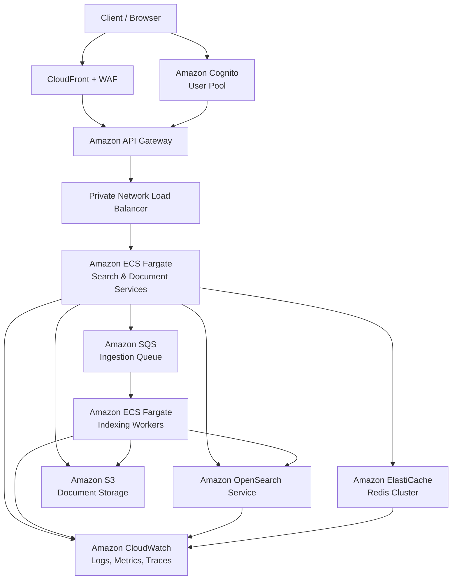

# AWS Architecture Design

## Overview

This document describes the AWS cloud architecture for deploying the Distributed Document Search Service at scale. The architecture is designed to handle 10M+ documents, 1000+ QPS, and achieve sub-500ms P95 latency while maintaining 99.95% availability.

## High-Level AWS Architecture



## Network Architecture

### VPC Design

**VPC Configuration:**
- **CIDR Block:** `10.0.0.0/16`
- **Region:** `us-east-1` (or preferred region)
- **DNS Resolution:** Enabled
- **DNS Hostnames:** Enabled

### Subnet Architecture

**Public Subnets (for NAT Gateways):**
- `10.0.1.0/24` - `us-east-1a` (Public Subnet A)
- `10.0.2.0/24` - `us-east-1b` (Public Subnet B)
- `10.0.3.0/24` - `us-east-1c` (Public Subnet C)

**Private Subnets (for Application Services):**
- `10.0.10.0/24` - `us-east-1a` (Private Subnet A)
- `10.0.11.0/24` - `us-east-1b` (Private Subnet B)
- `10.0.12.0/24` - `us-east-1c` (Private Subnet C)

**Data Subnets (for Databases/Cache):**
- `10.0.20.0/24` - `us-east-1a` (Data Subnet A)
- `10.0.21.0/24` - `us-east-1b` (Data Subnet B)
- `10.0.22.0/24` - `us-east-1c` (Data Subnet C)

### Internet Gateway & NAT Gateways

- **Internet Gateway:** Attached to VPC for public internet access
- **NAT Gateways:** 3 NAT Gateways (one per AZ) for private subnet outbound access
- **Route Tables:**
  - Public route table: Routes `0.0.0.0/0` → Internet Gateway
  - Private route table: Routes `0.0.0.0/0` → NAT Gateway

### VPC Endpoints (Optional but Recommended)

For improved security and cost optimization:
- **S3 VPC Endpoint:** Gateway endpoint for S3 access
- **SQS VPC Endpoint:** Interface endpoint for SQS access
- **CloudWatch Logs VPC Endpoint:** Interface endpoint for log shipping

## Compute Layer: Amazon ECS Fargate

### ECS Cluster Configuration

**Cluster Name:** `document-search-cluster`
**Capacity Provider:** Fargate
**Container Insights:** Enabled

### Service 1: Search Service

**Service Name:** `search-service`
**Task Definition:**
- **CPU:** 1024 (1 vCPU)
- **Memory:** 2048 MB (2 GB)
- **Platform Version:** LATEST
- **Network Mode:** awsvpc
- **Task Role:** `SearchServiceTaskRole` (for S3, SQS, CloudWatch access)
- **Execution Role:** `ECSTaskExecutionRole` (for ECR, CloudWatch Logs)

**Container Configuration:**
- **Image:** `your-account.dkr.ecr.us-east-1.amazonaws.com/document-search:latest`
- **Port Mappings:** 3000:3000
- **Environment Variables:**
  - `NODE_ENV=production`
  - `PORT=3000`
  - `OPENSEARCH_NODE=https://search-domain.us-east-1.es.amazonaws.com`
  - `OPENSEARCH_INDEX=documents`
  - `REDIS_HOST=redis-cluster.xxxxx.cache.amazonaws.com`
  - `REDIS_PORT=6379`
  - `S3_BUCKET=document-storage-bucket`
  - `SQS_QUEUE_URL=https://sqs.us-east-1.amazonaws.com/account/ingestion-queue`

**Auto Scaling:**
- **Min Capacity:** 2 tasks
- **Max Capacity:** 20 tasks
- **Target Tracking:** CPU utilization at 70%
- **Target Tracking:** Memory utilization at 80%
- **Step Scaling:** Scale out on high request count

**Load Balancer:**
- **Type:** Network Load Balancer (private)
- **Scheme:** Internal
- **Listeners:** TCP:3000
- **Target Group:** Health check on `/health` endpoint

**Deployment:**
- **Strategy:** Rolling update
- **Health Check Grace Period:** 60 seconds
- **Desired Count:** 3 (one per AZ)

### Service 2: Document Service

**Service Name:** `document-service`
**Task Definition:**
- **CPU:** 512 (0.5 vCPU)
- **Memory:** 1024 MB (1 GB)
- Similar configuration to Search Service

**Auto Scaling:**
- **Min Capacity:** 2 tasks
- **Max Capacity:** 10 tasks
- **Target Tracking:** CPU utilization at 70%

### Service 3: Indexing Workers

**Service Name:** `indexing-worker-service`
**Task Definition:**
- **CPU:** 1024 (1 vCPU)
- **Memory:** 2048 MB (2 GB)
- **Container:** Same image, different entrypoint/command

**Auto Scaling:**
- **Min Capacity:** 1 task
- **Max Capacity:** 10 tasks
- **Target Tracking:** SQS queue depth (scale when > 100 messages)

**SQS Integration:**
- Workers poll SQS queue for indexing jobs
- Visibility timeout: 300 seconds
- Dead letter queue after 3 failed attempts

## Data Layer

### Amazon OpenSearch Service

**Domain Configuration:**
- **Domain Name:** `document-search-domain`
- **Engine:** OpenSearch 2.11
- **Instance Type:** `r6g.large.search` (3 nodes)
- **Instance Count:** 3 (one per AZ)
- **EBS Volume:** 100 GB gp3 per node
- **Dedicated Master Nodes:** `r6g.medium.search` (3 nodes)
- **Multi-AZ:** Enabled

**Network:**
- **VPC:** Deployed in Data Subnets (10.0.20.0/24, 10.0.21.0/24, 10.0.22.0/24)
- **Security Group:** `opensearch-sg` (allows inbound from ECS security group on port 443)

**Access Control:**
- **Fine-grained access control:** Enabled
- **Master user:** IAM role-based (not username/password)
- **Node-to-node encryption:** Enabled
- **Encryption at rest:** Enabled (KMS)

**Index Configuration:**
- **Index Name:** `documents`
- **Shards:** 5 primary shards
- **Replicas:** 1 replica per shard
- **Index Lifecycle Management:** Enabled
  - Hot tier: 30 days
  - Warm tier: 90 days
  - Delete after: 365 days

**Performance Tuning:**
- **JVM Heap:** 50% of instance memory
- **Refresh Interval:** 1 second (near-real-time)
- **Query Cache:** Enabled
- **Filter Cache:** Enabled

### Amazon ElastiCache for Redis

**Cluster Configuration:**
- **Engine:** Redis 7.x
- **Node Type:** `cache.r6g.large` (13.07 GB memory)
- **Number of Nodes:** 3 (one per AZ)
- **Multi-AZ:** Enabled with automatic failover
- **Replication:** 1 replica per primary

**Network:**
- **Subnet Group:** Data Subnets
- **Security Group:** `redis-sg` (allows inbound from ECS security group on port 6379)

**Configuration:**
- **Parameter Group:** Custom (tuned for caching)
- **Backup:** Daily snapshots, 7-day retention
- **Encryption:** In-transit (TLS) and at-rest (KMS)

**Scaling:**
- **Horizontal Scaling:** Add shards as needed
- **Vertical Scaling:** Upgrade node types
- **Auto-failover:** Enabled

### Amazon S3

**Bucket Configuration:**
- **Bucket Name:** `document-storage-{account-id}-{region}`
- **Versioning:** Enabled
- **Encryption:** SSE-S3 or SSE-KMS
- **Lifecycle Policies:**
  - Transition to Standard-IA after 30 days
  - Transition to Glacier after 90 days
  - Delete incomplete multipart uploads after 7 days

**Bucket Structure:**
```
s3://document-storage-bucket/
  ├── tenant-123/
  │   ├── doc-1.pdf
  │   ├── doc-2.docx
  │   └── ...
  ├── tenant-456/
  │   └── ...
```

**Access Control:**
- **Bucket Policy:** Deny public access
- **IAM Policies:** ECS tasks can read/write to tenant-specific prefixes

### Amazon SQS

**Queue Configuration:**
- **Queue Name:** `document-ingestion-queue`
- **Queue Type:** Standard Queue
- **Visibility Timeout:** 300 seconds
- **Message Retention:** 14 days
- **Dead Letter Queue:** `document-ingestion-dlq` (after 3 failed attempts)

**Message Format:**
```json
{
  "tenantId": "tenant-123",
  "docId": "doc-1",
  "s3Key": "tenant-123/doc-1.pdf",
  "contentType": "application/pdf",
  "timestamp": "2025-01-01T12:00:00Z"
}
```

## API Gateway & Edge Services

### Amazon API Gateway

**API Configuration:**
- **API Type:** REST API
- **API Name:** `document-search-api`
- **Stage:** `prod`
- **Endpoint Type:** Regional

**Integration:**
- **Integration Type:** VPC Link
- **VPC Link:** Connects to private NLB
- **Target:** Private NLB DNS name

**Resources & Methods:**
- `POST /documents` → Document Service
- `GET /search` → Search Service
- `GET /documents/{id}` → Search Service
- `DELETE /documents/{id}` → Document Service
- `GET /health` → Search Service (no auth required)

**Authentication:**
- **Authorizer:** Cognito User Pool Authorizer
- **Token Source:** Authorization header (Bearer token)
- **Unauthorized Responses:** 401 Unauthorized

**Rate Limiting:**
- **Usage Plans:** Per-tenant usage plans
- **Throttle:** 100 requests/second per API key
- **Quota:** 1M requests/day per API key

**CORS:**
- **Allowed Origins:** Configured for frontend domains
- **Allowed Methods:** GET, POST, DELETE
- **Allowed Headers:** Authorization, Content-Type, X-Tenant-Id

### Amazon CloudFront

**Distribution Configuration:**
- **Origin:** API Gateway endpoint
- **Origin Protocol:** HTTPS only
- **Cache Behavior:** No caching (all requests forwarded)
- **Viewer Protocol Policy:** Redirect HTTP to HTTPS

**WAF Integration:**
- **Web ACL:** Attached to CloudFront
- **Rules:**
  - AWS Managed Rules: Common protections
  - Rate-based rules: 2000 requests per 5 minutes per IP
  - Geo-blocking: Block known malicious countries (optional)

### Amazon Route 53

**DNS Configuration:**
- **Record Type:** A (Alias)
- **Alias Target:** CloudFront distribution
- **Domain:** `api.search.example.com`
- **Health Checks:** Enabled

## Security Architecture

### Security Groups

**1. ECS Service Security Group (`ecs-service-sg`):**
- **Inbound:**
  - Port 3000 from NLB security group
- **Outbound:**
  - Port 443 to OpenSearch security group
  - Port 6379 to Redis security group
  - Port 443 to S3 (via VPC endpoint)
  - Port 443 to SQS (via VPC endpoint)
  - Port 443 to CloudWatch Logs (via VPC endpoint)

**2. OpenSearch Security Group (`opensearch-sg`):**
- **Inbound:**
  - Port 443 from ECS service security group
- **Outbound:**
  - None (no outbound required)

**3. Redis Security Group (`redis-sg`):**
- **Inbound:**
  - Port 6379 from ECS service security group
- **Outbound:**
  - None

**4. NLB Security Group (`nlb-sg`):**
- **Inbound:**
  - Port 3000 from API Gateway (VPC Link)
- **Outbound:**
  - Port 3000 to ECS service security group

### IAM Roles & Policies

**1. ECS Task Execution Role (`ECSTaskExecutionRole`):**
```json
{
  "Version": "2012-10-17",
  "Statement": [
    {
      "Effect": "Allow",
      "Action": [
        "ecr:GetAuthorizationToken",
        "ecr:BatchCheckLayerAvailability",
        "ecr:GetDownloadUrlForLayer",
        "ecr:BatchGetImage",
        "logs:CreateLogStream",
        "logs:PutLogEvents"
      ],
      "Resource": "*"
    }
  ]
}
```

**2. ECS Task Role (`SearchServiceTaskRole`):**
```json
{
  "Version": "2012-10-17",
  "Statement": [
    {
      "Effect": "Allow",
      "Action": [
        "es:ESHttpGet",
        "es:ESHttpPost",
        "es:ESHttpDelete"
      ],
      "Resource": "arn:aws:es:us-east-1:account:domain/document-search-domain/*"
    },
    {
      "Effect": "Allow",
      "Action": [
        "s3:GetObject",
        "s3:PutObject"
      ],
      "Resource": "arn:aws:s3:::document-storage-bucket/*"
    },
    {
      "Effect": "Allow",
      "Action": [
        "sqs:SendMessage",
        "sqs:ReceiveMessage",
        "sqs:DeleteMessage"
      ],
      "Resource": "arn:aws:sqs:us-east-1:account:document-ingestion-queue"
    }
  ]
}
```

**3. OpenSearch Access Policy:**
```json
{
  "Version": "2012-10-17",
  "Statement": [
    {
      "Effect": "Allow",
      "Principal": {
        "AWS": "arn:aws:iam::account:role/SearchServiceTaskRole"
      },
      "Action": "es:*",
      "Resource": "arn:aws:es:us-east-1:account:domain/document-search-domain/*"
    }
  ]
}
```

### Encryption

**Encryption at Rest:**
- **OpenSearch:** KMS customer-managed key
- **Redis:** KMS customer-managed key
- **S3:** SSE-S3 or SSE-KMS
- **EBS Volumes:** Encrypted with KMS

**Encryption in Transit:**
- **API Gateway → ECS:** TLS 1.2+
- **ECS → OpenSearch:** TLS 1.2+
- **ECS → Redis:** TLS 1.2+
- **CloudFront → API Gateway:** TLS 1.2+

## Authentication & Authorization

### Amazon Cognito

**User Pool Configuration:**
- **User Pool Name:** `document-search-users`
- **Sign-in Options:** Email
- **Password Policy:** Strong password requirements
- **MFA:** Optional (recommended for production)

**Custom Attributes:**
- `tenant_id` (String, Mutable)

**App Client:**
- **App Client Name:** `document-search-client`
- **Auth Flows:** ALLOW_USER_PASSWORD_AUTH, ALLOW_REFRESH_TOKEN_AUTH
- **Generate Client Secret:** No (for public clients)

**JWT Token Claims:**
- `sub`: User ID
- `email`: User email
- `custom:tenant_id`: Tenant identifier
- `exp`: Expiration time

**Integration with API Gateway:**
- API Gateway uses Cognito User Pool as authorizer
- Validates JWT tokens
- Extracts `custom:tenant_id` claim for tenant context

## Observability

### Amazon CloudWatch Logs

**Log Groups:**
- `/ecs/search-service`
- `/ecs/document-service`
- `/ecs/indexing-worker-service`
- `/aws/opensearch/domains/document-search-domain`

**Log Retention:** 30 days (configurable)

**Log Format:** JSON structured logs

### Amazon CloudWatch Metrics

**Custom Metrics:**
- `SearchLatency` (P50, P95, P99)
- `SearchQPS` (per tenant)
- `DocumentIndexLatency`
- `CacheHitRatio`
- `RateLimitViolations` (per tenant)
- `ErrorRate` (per endpoint)

**Alarms:**
- P95 latency > 500ms → Alert
- Error rate > 1% → Alert
- OpenSearch cluster health = RED → Critical alert
- Redis memory usage > 80% → Warning

### AWS X-Ray

**Tracing:**
- **Service:** Enabled on ECS tasks
- **Sampling Rate:** 10% (configurable)
- **Trace ID:** Propagated across services

**Traced Components:**
- API Gateway
- ECS Services
- OpenSearch queries
- Redis operations
- S3 operations

## Cost Optimization

### Reserved Instances & Savings Plans

- **OpenSearch:** Reserved Instances for 1-year or 3-year terms
- **ElastiCache:** Reserved Instances for predictable workloads
- **ECS Fargate:** Compute Savings Plans

### Auto Scaling

- Scale down during off-peak hours
- Use scheduled scaling for predictable patterns
- Right-size instance types based on actual usage

### Data Lifecycle

- Archive old documents to S3 Glacier
- Delete old indices in OpenSearch (via ILM)
- Compress logs before archiving

## Disaster Recovery

### Backup Strategy

**OpenSearch:**
- Automated snapshots to S3 (daily)
- Manual snapshots before major changes
- Cross-region replication (optional)

**Redis:**
- Daily automated backups (7-day retention)
- Manual snapshots before deployments

**S3:**
- Versioning enabled
- Cross-region replication to DR region

### Multi-Region Setup (Future)

- Primary region: `us-east-1`
- DR region: `us-west-2`
- Route 53 health checks for failover
- Cross-region data replication

## Scaling Considerations

### Horizontal Scaling

**ECS Services:**
- Auto-scaling based on CPU, memory, request count
- Scale out: Add more tasks
- Scale in: Remove tasks during low traffic

**OpenSearch:**
- Add data nodes to increase capacity
- Increase replicas for read scaling
- Split indices if shard size > 50GB

**Redis:**
- Add shards to Redis cluster
- Increase node size for vertical scaling

### Vertical Scaling

- Upgrade OpenSearch instance types
- Increase ECS task CPU/memory
- Upgrade Redis node types

## High Availability

### Multi-AZ Deployment

- All services deployed across 3 Availability Zones
- OpenSearch: 3 nodes (one per AZ)
- Redis: Multi-AZ with automatic failover
- ECS: Tasks distributed across AZs

### Health Checks

- **ECS:** Health checks on `/health` endpoint
- **NLB:** Health checks on target group
- **Route 53:** Health checks for DNS failover

### Failover Mechanisms

- **OpenSearch:** Automatic replica promotion
- **Redis:** Automatic failover to replica
- **ECS:** Unhealthy tasks replaced automatically
- **API Gateway:** VPC Link failover to healthy targets

